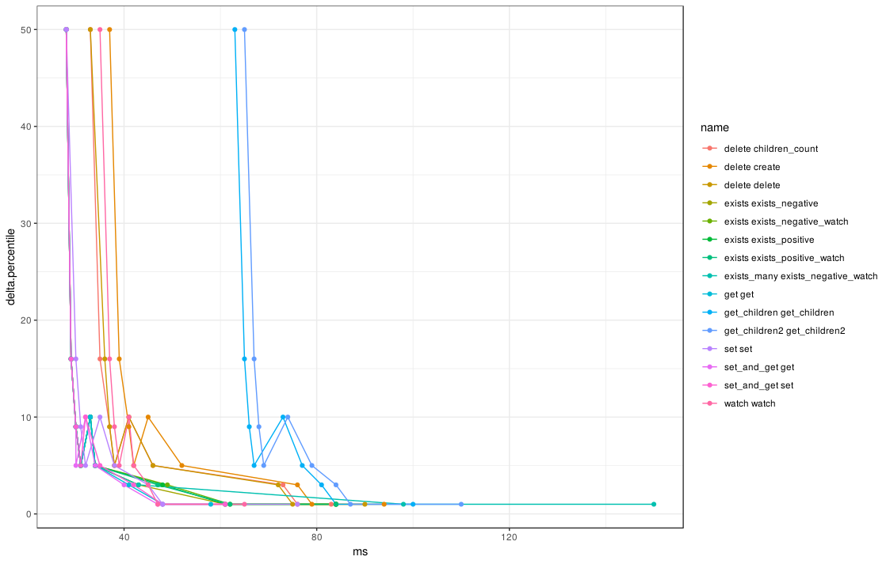
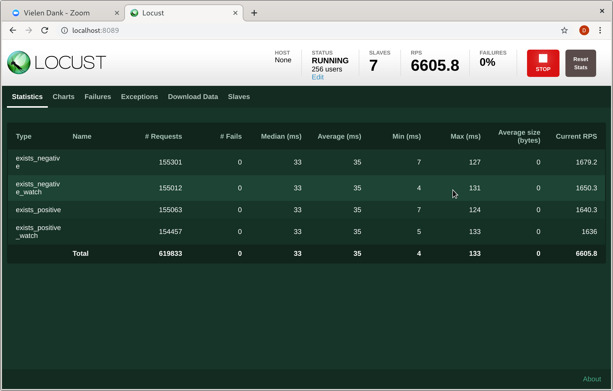
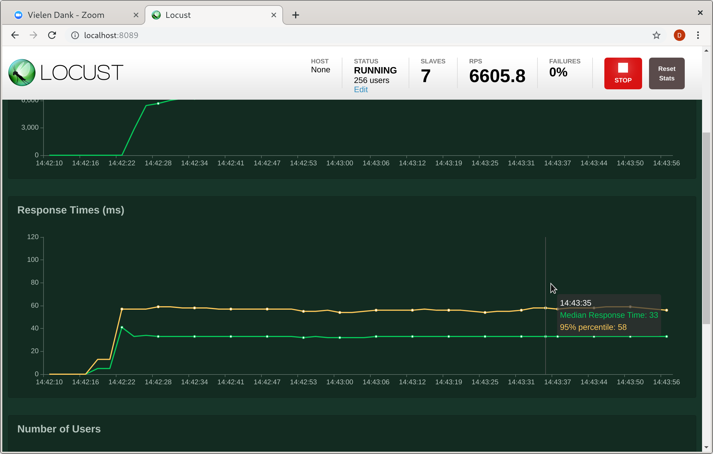

# Load-testing ZooKeeper using Locust

## Description

An experimental "test harness" for ZooKeeper.

## Quick Start

 1. Install [Locust](https://locust.io/).  (Versions 0.9.0 and HEAD
    have been tested, with Python 3.7.4.)

 2. Install [Kazoo](https://kazoo.readthedocs.io/en/latest/).
    (Versions 2.6.1 and `HEAD` have been tested.  `HEAD` is required
    for SASL support.)

 3. Install and configure ZooKeeper (left as an exercise for the
    reader).

 4. `export ZK_LOCUST_HOSTS=<ensemble>`.

 5. Run a simple test using the Web UI:

        $ locust -f locust_set.py
        INFO/locust.main: Starting web monitor at *:8089
        INFO/locust.main: Starting Locust 0.11.1

    In the Web UI (at `http://localhost:8089` by default), enter
    e.g. 128 (users), 32 (/second), and activate "Start swarming."
    Click "STOP" then kill the `locust` command when satisfied.

 6. Run a 7-worker instance, "distributed" as processes on a single
    machine:

        $ mkdir -p tmp
        $ ./multi-locust.sh 7 tmp -f locust_set.py
        locust.main: Starting web monitor at *:8089
        locust.main: Starting Locust 0.11.1
        locust.runners: Client 'teek_14bd0d516df3487a8d173d6cd5018fdf' reported as ready. Currently 1 clients ready to swarm.
        […]
        locust.runners: Client 'teek_370e1be12b7a454284dc3b3bee37c709' reported as ready. Currently 7 clients ready to swarm.

    Note how it is now possible to keep a multicore machine busy.

 7. Run a headless (`--no-web`) 7-worker instances on a number of test
    cases, collecting (some) statistics, using the provided Make
    recipe:

        $ make
        […]
        $ ls out/*.csv | wc -l
        18
        $ tail -n 8 out/set_and_get.log
        Percentage of the requests completed within given times
         Name     # reqs    50%    66%    75%    80%    90%    95%    98%    99%   100%
        --------------------------------------------------------------------------------------
         get      207341     28     29     30     30     32     34     40     47     61
         set       20819     28     29     30     31     32     35     42     48     61
        --------------------------------------------------------------------------------------
         Total    228160     28     29     30     30     32     34     40     47     61

 8. Run a many-worker instances, across a fleet of machines.  (Left as
    an exercise for the reader.)

## Locust Utilities

A number of utilities are provided in the `zk_locust` module:

  * `KazooLocustClient`: A Locust "client" object which provides
    helper methods as well as direct access to the Kazoo client object
    via `get_zk_client`;

  * `ZKLocustClient`: Similar to `KazooLocustClient`, but its backend
    is thin wrapper around `zkpython`--which allows exercising the
    "official" ZooKeeper client library;

  * `ZKLocust`: A Locust subclass which can host task sets and is
    automatically initialized with an instance of `KazooLocustClient`
    (default) or `ZKLocustClient` as the client;

  * `LocustTimer`: A Python "Context Manager" which makes it easy to
    time requests or segments.

## Extended Statistics Utilities

The `locust_extra.stats` module allows to collect an extended set of
statistics compared to Locust's normal `--csv` parameter.

A Locust script can enable the monitor by including the following bit:

    from locust_extra.stats import register_extra_stats
    register_extra_stats()

The `--stats-collect` / `LOCUST_EXTRA_STATS_COLLECT` and `--stats-csv`
/ `LOCUST_EXTRA_STATS_CSV` parameters (or the "distrib" equivalent)
direct the dumping of Locust statistics as time series.  See
"Parameters" below for details.

## ZooKeeper Metrics Utilities

The `zk_metrics` module integrates ZooKeeper metrics with the Locust
Web application and CSV output.  A Locust script can use the following
bit to register a ZooKeeper metrics monitor:

    from zk_metrics import register_zk_metrics
    register_zk_metrics()

If the Web UI is enabled via the `--zk-metrics-collect` /
`ZK_LOCUST_ZK_METRICS_COLLECT` collection parameter (see "Parameters"
below), the monitor adds a page under `/zk-metrics` in the Locust UI.

That page, when open, regularly polls the servers of the ensemble to
gather metrics

 1. whose "instant" value can be displayed on the "Statistics" page;

 2. whose "history" can be plotted on the "Charts" page;

 3. which are recorded to the file specified via `--zk-metrics-csv` /
    `ZK_LOCUST_ZK_METRICS_CSV`.

Points 1/ and 2/ can help interactive exploration, whereas 3/ enables
"offline" data analysis.  Alternatively, the collection parameter can
be set to an integer number of milliseconds to perform Locust-side
polling without setting up a Web UI.

## Parameters

### "ZK Locust" Parameters

Most parameters can either be controlled by "flag" arguments to the
`parameterized-locust.sh` wrapper script (starting with `--`), or by
setting (upper-case) environment variables.  (Note that the wrapper
systematically clears the latter when the flag argument is known.)

  * `--hosts`, `ZK_LOCUST_HOSTS`: A ZooKeeper "connect string"
    including the addresses of the ensemble;

  * `--client`, `ZK_LOCUST_CLIENT`: Selects the `ZKLocust` backend,
    unless overriden by a subclass.  Valid values include `kazoo`
    (default) and `zkpython`;

  * `--pseudo-root`, `ZK_LOCUST_PSEUDO_ROOT`: A "pseudo root" for
    tests.  Note that this is not a "chroot" in the ZooKeeper sense;
    it is purely advisory;

  * `--min-wait`, `ZK_LOCUST_MIN_WAIT`: The default value of the
    `min_wait` Locust setting used by `ZKLocust` subclasses (defaults
    to `0`);

  * `--max-wait`, `ZK_LOCUST_MAX_WAIT`: The default value of the
    `max_wait` Locust setting used by `ZKLocust` subclasses (defaults
    to `ZK_LOCUST_MIN_WAIT`);

  * `--key-size`, `ZK_LOCUST_KEY_SIZE`: The (advisory) byte length of
    the key names to be generated by tests;

  * `--val-size`, `ZK_LOCUST_VAL_SIZE`: The (advisory) byte length of
    the payloads to be generated by tests;

  * `--kazoo-handler`, `KAZOO_LOCUST_HANDLER`: Selects the Kazoo
    concurrency "handler."  Valid values include `threading` and
    `gevent`.  The default depends on Kazoo, but normally corresponds
    to `threading`;

  * `--kazoo-sasl-options`, `KAZOO_LOCUST_SASL_OPTIONS`: An optional
    JSON-encoded dictionary of SASL options for the Kazoo backend.
    The default is to not authenticate with the server;

  * `KAZOO_LOCUST_CREATE_CLIENT`: If set to a non-empty string,
    contains code which is `exec`uted via Python to create the Kazoo
    client.

    The local scope contains a binding `kwargs` holding the normal set
    of constructor arguments.  The created object must be assigned to
    the `client` local variable.  E.g.:

        export KAZOO_LOCUST_CREATE_CLIENT='
        new_kwargs = kwargs
        new_kwargs.update({"my_extra_param": 42})

        client = kazoo.client.KazooClient(**new_kwargs)
        '

  * `--zk-metrics-collect`, `ZK_LOCUST_ZK_METRICS_COLLECT`: Determine
    the collection method used by the `zk_metrics` monitor; either
    `web` (the default) to have the monitor driven by the Web UI, or a
    millisecond delay, for no Web UI and Locust-side polling;

  * `--zk-metrics-csv`, `ZK_LOCUST_ZK_METRICS_CSV`: Path to a CSV file
    to be created by the `zk_metrics` monitor.

  * `--stats-collect`, `LOCUST_EXTRA_STATS_COLLECT`: A millisecond
    delay for extended statistics collection, or `0` (the default) to
    disable it;

  * `--stats-csv`, `LOCUST_EXTRA_STATS_CSV`: Path to the CSV file in
    which to collect extended statistics;

  * `--stats-distrib`, `LOCUST_EXTRA_STATS_DISTRIB`: Path to the file
    in which to collect full (rounded) distributions.

  * `--bench-*`: As a special case, an open-ended set of "benchmark"
    parameters is accepted; those are not validated and simply
    "forwarded" to corresponding `ZK_LOCUST_BENCH_*` variables.  E.g.,
    `--bench-the-answer 42` is equivalent to:

        export ZK_LOCUST_BENCH_THE_ANSWER=42

### Reporting Parameters

The `parameterized-locust.sh` script can be directed to generate a
report when the locust runner exists.  The unique reporting parameter
currently is:

  * `--report-dir`: The name of a directory to use to store the
    collected metrics and generate a "human-readable" report.

It is recommended *not* to use `--zk-metrics-csv` or `--stats-csv` in
conjunction with `--report-dir` to allow the script to use
conventionally named files in that directory.

## "Locustfiles" Starter Kit

The `locust_*.py` files are "locustfiles," and test various aspects of
the target ZooKeeper ensemble.

Most are composed of boilerplate code, and use "operations" and "task
sets" which have been factored out to the `zk_locust.ops` and
`zk_locust.task_sets` modules, respectively.

One notable exception is `locust_sequence.py`, which implements a
complete "suite" of tests to be run sequentially.

  * TODO(ddiederen): Generate more representative loads.

## Examples

Running the `locust_sequence.py` suite in standalone mode, unleashing
256 clients on `$MY_ENSEMBLE`, collecting metrics every 500ms, and
finally generating a report in `../my-report-3`:

    ./parameterized-locust.sh                   \
        --hosts "$MY_ENSEMBLE"                  \
        --kazoo-handler gevent                  \
        --min-wait 150                          \
        --max-wait 300                          \
        --stats-collect 500                     \
        --zk-metrics-collect 500                \
        --bench-step-duration 15                \
        --report-dir ../my-report-3             \
        --                                      \
            --reset-stats --no-web              \
            -c 256 -r 64                        \
            -f locust_sequence.py

## Pictures

### Captured data

The CSV files produced by `--no-web` do not contain full histograms,
but rather focus on on tail latencies.  While these do not lend
themselves to smooth curves, they can still be quickly visualized and
compared by plotting:

### Web UI Screenshots

